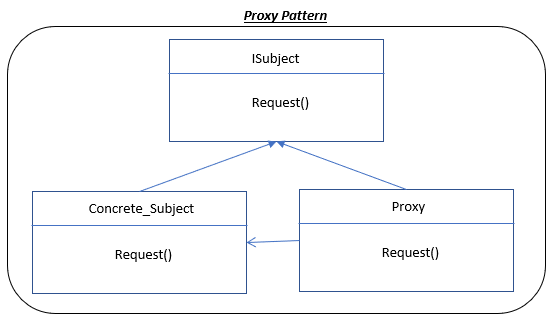

# OOP---Design-Patterns
Examples of Design Pattern concepts - Mostly in JAVA
I have simple examples of 12 main used design patterns mentioned in the gang of four book.
Here I have tried to make simple examples that I think are easier to follow than reading texts from the book.
I have the examples in C++ and Java but here I would probably add mostly Java as they are easier to follow.
Since this is for showing examples and learning, I tried to make a single file that has all the interface and anstract classes in that, so following the concept becomes easier and one does not have to go through multiple files.
If you have any questions please contact me.

## Example of Composite Pattern added
This example is for a book that has hierachy of chapters. You can add sub-chapters to each chapter that the main book itself is also a chapter class. Each chapter class (and also the book) has a method that shows all the sub-chapters. So after adding all the chapters and their sub-chapters, you can run the show method to see the outline of the book.

## Example of Strategy Pattern added
In this example three behavious are defined: Flying, Eating, Speaking - as abstract classes
For each of these behaviours there are several options degined as classes that extend these behaviour abstracts. For example Flying has three options: HighFly, Jump, and NoFly. Similarly the other behaviours also have three options as an example.
When we define our object that is supposed to have these behaviours, we can inject the chosen behaviour suitable for that object to that object. The beauty of using this design pattern is that later we can change the behaviour method of the already defined if we need to.
Using this approach gives a lot of flexibility in defining and modifying objects method from a set of pre-defined method of behaviour.

## Example of Observer Pattern added
In this example, you can define a stock as being a observable class. This observerable class, contain a list of observers (that with a method you can add or remove observers). When the value of the stock is changed (here through a method setValue, but could be implemented differently), the observable 'stock' object will notify its list of observers by calling its Notify() method, and this Notify method would go over the obeservers list and call their update method. When the observer update() method is called, it will pull the new value of the stock by calling the getValue method of the observable and updates its state. 
This would help a lot that the observers, dont miss a change of the value of the object that they care about and dont need to constantly check in interval times. They will be notified of the change as soon as it has been changed.

## Example of Template method
Very useful and common method. In this example it has been used for solving leetcode 1396. Design Underground System.
In this interesting problem we want to searh for a trip in O(1). A trip is define by two parts: startStation and endStation. So in principle we want to search a hashtable with two keys. This is implemented by a class using template method that takes the two parts and overrides their hashCode method and creates a new hashCode for the combined Key object. To be able to search in the hashmap the equal method has also been overriden.
The same method is also used for Value class. Although hashCode() and equals() methods are not needed.
Template T is used in this solution so that the method can be applied to other problems when searching with two keys are needed.  

## Example of Proxy Pattern
Proxy pattern is used when for example creating an object could be computationally or memory expensive. Or when permission cannot be directly granted to an object and first need some authentication. In this example, a data_generator for Fibonacci series is created through the proxy and user contact that only through the proxy. The proxy has an Fibonacci data_generator. Both proxy and concrete object of Fibonacci are extended from the same data_generator abstract class.

